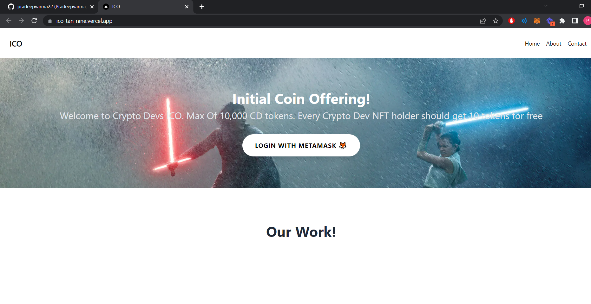
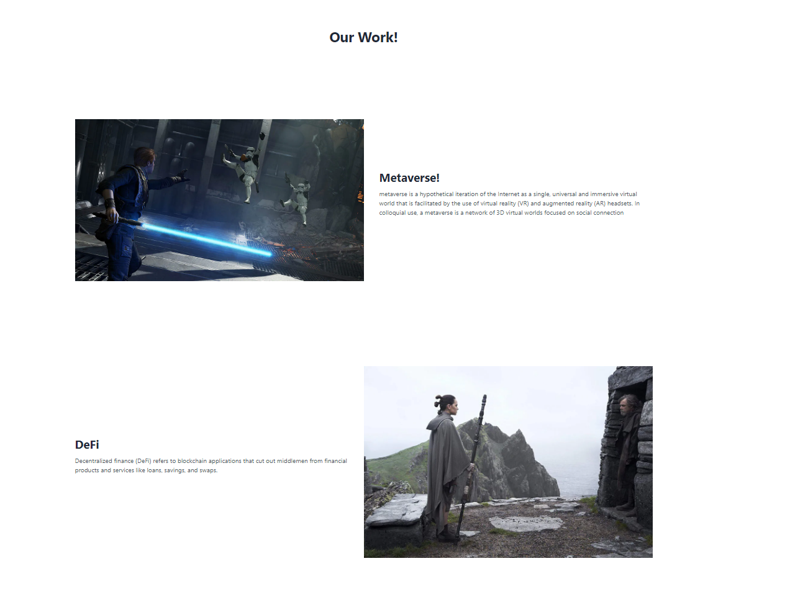
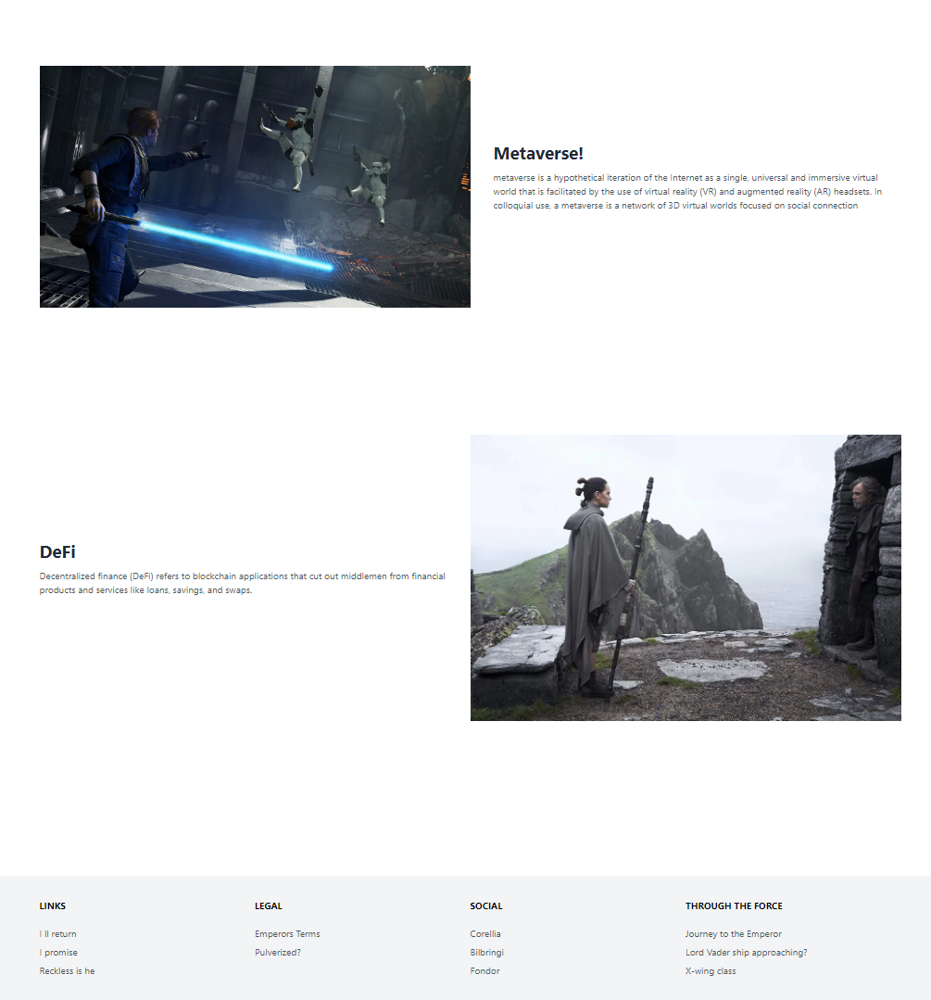
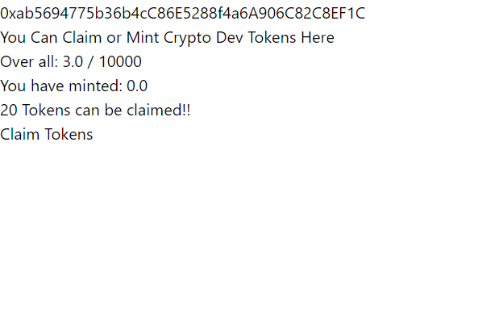

# ICO: Initial Coin Offering (ICO)

# Requirements

<li> There should be a max of 10,000 tokens. </li>
<li> Every Crypto Dev NFT holder should get 10 tokens for free but they would have to pay the gas fees.  </li>
<li>The price of one CD at the time of ICO should be 0.001 ether. </li>
<li>There should be a website that users can visit for the ICO.  </li>

# Deployed to vercel
<a href="ico-tan-nine.vercel.app" target="_blank">ico-tan-nine.vercel.app</a>

### UI

### Claim

## Video

https://user-images.githubusercontent.com/28341697/188287242-827e6c2b-7861-4344-b882-b4689876a878.mp4

